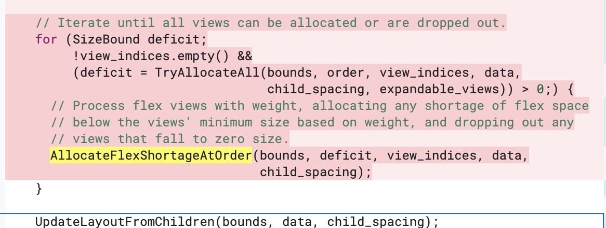
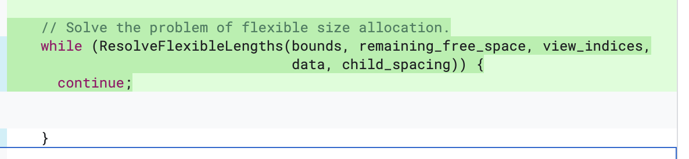
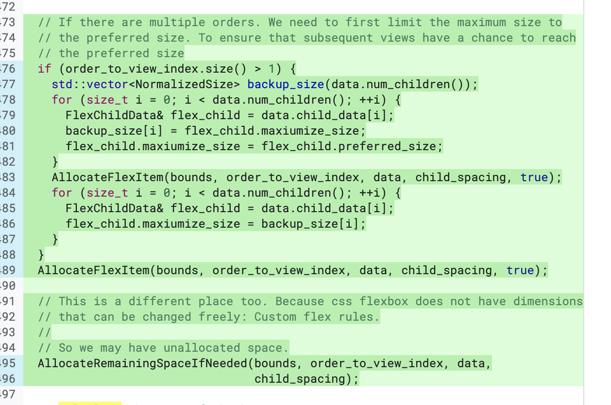

假设在flexlayout中存在k个分配顺序，每个分配中存在 $m_1,m_2,...,m_k$ 个元素。则旧算法的最劣复杂度为 $O(\sum_{i=1}^k\frac{m_k*(m_k + 1)}{2})$

显然

$$
\sum_{i=1}^k\frac{m_k*(m_k + 1)}{2} \leq \frac{n*(n + 1)}{2}
$$

因此旧算法的复杂度为 $O_{old} = O(n^2)$ 。

新算法, 在图中位置的复杂度也是 $O(\frac{m_k*(m_k + 1)}{2})$ :

在k=1时。复杂度为 $2 * O(\sum_{i=1}^k\frac{m_k*(m_k + 1)}{2}) = O(n*(n + 1)) = O(n^2)$

在 $k\geq 2$ 时，这里会带来额外的常数复杂度倍数

复杂度为

$$
\begin{aligned}
3* O(\sum_{i=1}^k\frac{m_k*(m_k + 1)}{2}) &= \frac{3}{2}* O(\sum_{i=1}^km_k^2 + \sum_{i=1}^km_k) \\
&=\frac{3}{2}*O(\sum_{i=1}^km_k^2 + n) \\
&\leq \frac{3}{2}O(n^2+n) \\
&=3*O_{old}
\end{aligned}
$$

这里的常数倍数计算并不严谨，但是最终可以看出优化系数级别是相近的。所以我认为最终的结论是新算法可能带来的复杂度提升可以忽略。
